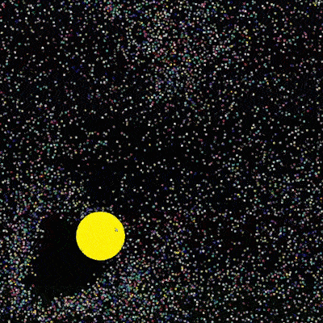
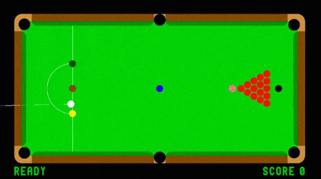
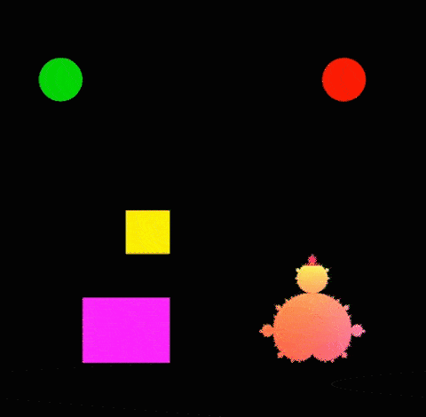

# Physics2D
C++ single header 2D physics engine implementation. Simple to use and ideal for rendering, games, and other experimentation.

Usage...

 During setup:
```		
  p2d::Physics physics;
  p2d::CircleBody circleBody(radius, x, y, mass, restitution);
  physics.add(&circleBody);
```  

 On every frame:
```		
  physics.update(dt);

```






